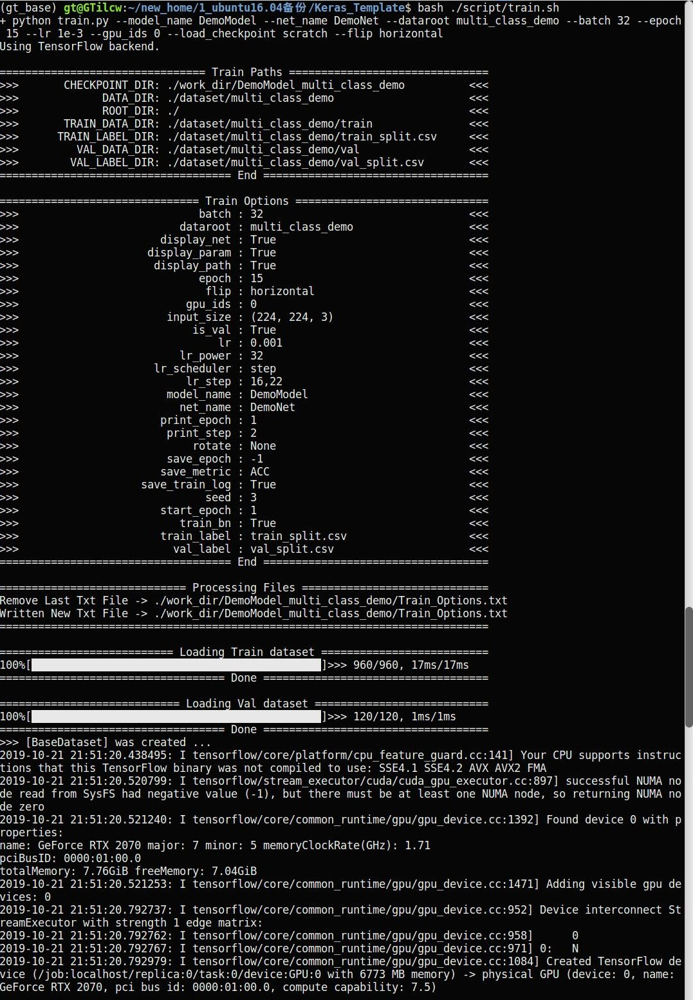
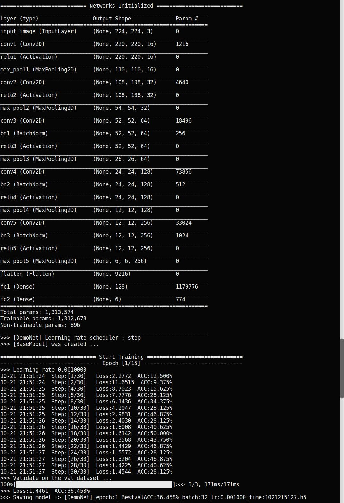
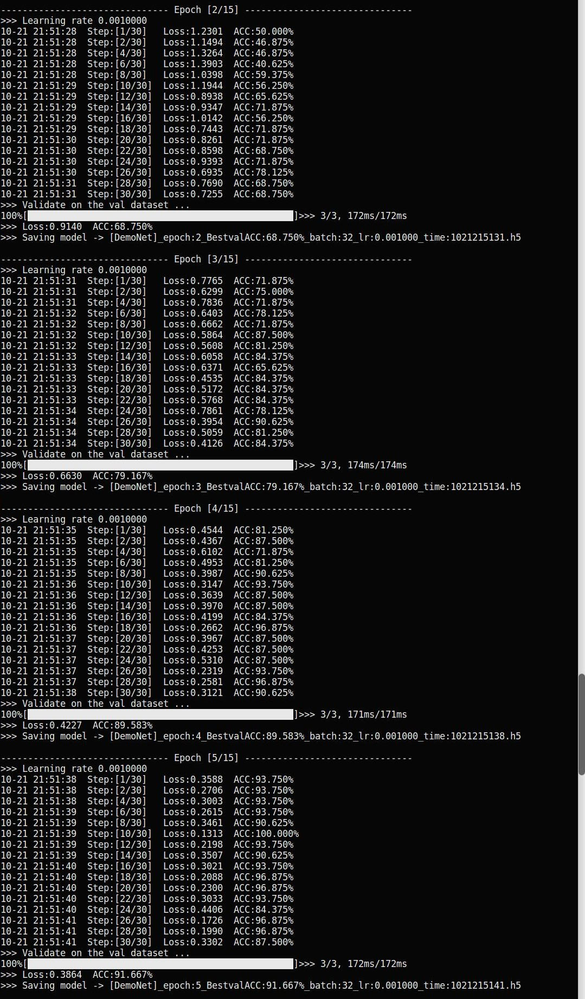
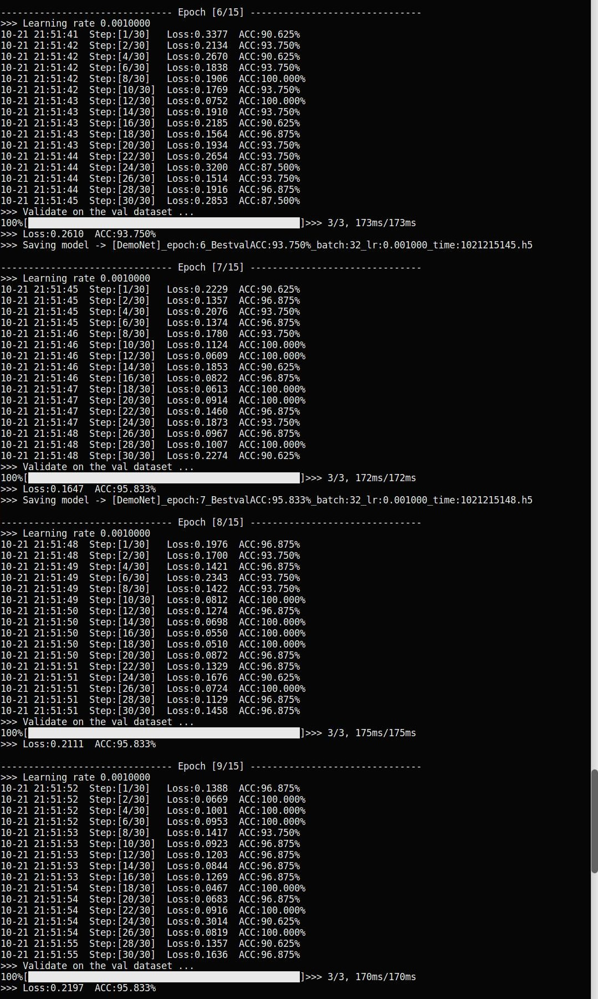
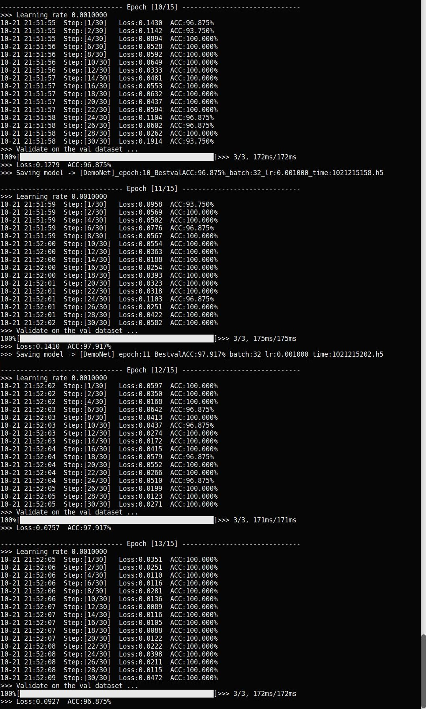
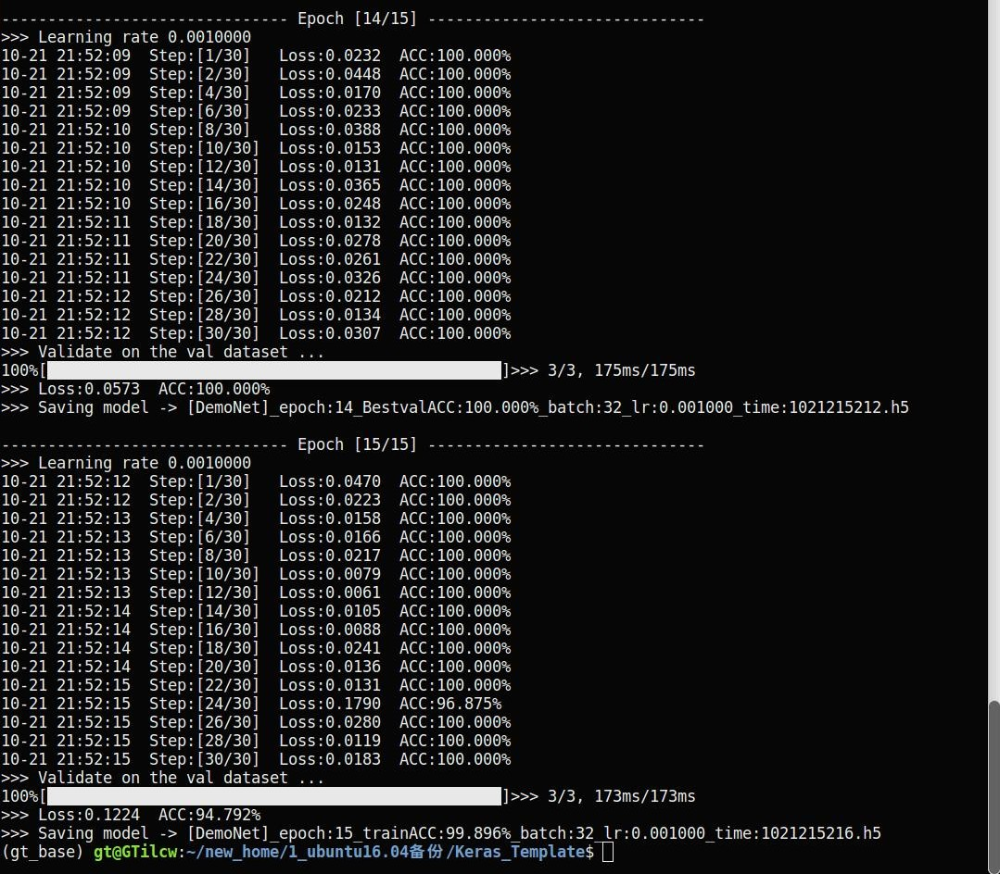

# Keras_Template
You only need three step to use a functional template project for your any missions. A deep learning project template with simple modification based on Keras.  
The Data Generator(Keras) is encapsulated as a Data Loader similar to the Pytorch, which makes the whole project structure and data flow consistent with the Pytorch project, and makes the codes of the two frameworks more general and easier to migrate with each other.  
**`1.Strong scalability`**  
**`2.Clear structure`**  
**`3.Three step to modify`**  
**`4.Easy to migrate`** 

>RELATED LINKS  
>① Keras_Template --> [https://github.com/gtdhm/Keras_Template](https://github.com/gtdhm/Keras_Template)   
>② Pytorch_Template --> [https://github.com/gtdhm/Pytorch_Template](https://github.com/gtdhm/Pytorch_Template) 

## Requirements


  
* Python >= 3.5 (3.6 recommended)
* numpy
* h5py
* keras>=2.1.3
* tensorflow>=1.5.0

## Structures
```
keras_template/

│
├── database                >>> Load and transform the datasets to the model as inputs.
│   ├── __init__.py          -- use DataLoader to get batch datasets.
│   └── base_dataset.py
│
├── dataset                 >>> Store the original datasets and its label files.
│   ├── binary_class_demo
│   └── multi_class_demo
│
├── model                   >>> The center of whole project.
│   ├── __init__.py
│   ├── base_model.py        -- to initialize and control the model training and testing processes.
│   ├── base_network.py      -- the whole network architectures implementation.
│   └── base_loss.py         -- add your own defined losses here, which are not in Keras.
│
├── option                  >>> Total configurations and options of the model.
│   ├── __init__.py        
│   ├── base_options.py
│   ├── train_options.py
│   └── test_options.py   
│
├── util                    >>> Useful tools for the model.
│   ├── __init__.py 
│   ├── utils.py             -- the set of some helper functions.
│   └── visuals.py           -- directly observe the operation of the model and network.
│   
├── work_dir                >>> The output for training and testing.
│         
│
├── script                  >>> Main script to train or test the project.
│   ├── train.sh
│   └── test.sh
│
├── train.py                >>> Train and val the model.
└── test.py                 >>> Test or evaluate the model.
```
## Demo
The template has prepared all you needs to run, including multi classification dataset and trained checkpoint. So you can feel free to modify the training and testing options in ./scrip/train.sh or test.sh.
```Bash
git clone https://github.com/gtdhm/Keras_Template.git
cd Keras_Template
# train
python3 ./script/train.sh
# test
python3 ./script/test.sh
```
>*Run results on the command line：






## Usage
This will show you how to modify this template step by step simply. In other words, where you need to adapt to different project tasks and the rest you don't need to modify. 
- `*KEY: You just need to modify the code between the following:`
```Python
# TODO(User) >>> ..... 
  code 
# TODO(User): End
```
 1. **modify the .option/**  
    **`--> base_options.py`**
    ```Python
    # TODO(User) >>> modify the class name of your labels in Order!
        self.class_name = ['zero', 'one', 'two', 'three', 'four', 'five']
    # TODO(User): End
    ```
    **`--> train_options.py and test_options.py`**
    ```Python
    def add_parser(self):
    # TODO(User) >>> add your own train or test parse.
        # parser.add_argument()
    # TODO(User): End
    ```
 2. **modify the .database/**  
    **`--> base_dataset.py`**  
    ```Python
    def _add_to_database(self, index, data_set, path):
    # TODO(User) >>> add your own data encoding
        self.image_ids.append()
        self.label_info.update()
        self.image_info.update()
    # TODO(User): End
    
    def __getitem__(self, index):
    # TODO(User) >>> return your own data meta and transform
        image = self.transform(image)
        return image, self.label_info[index], self.image_info[index]["image_name"]
    # TODO(User): End
    ```
 3. **modify the .model/**  
    **`--> base_model.py`**  
    ```Python
    class BaseModel(object):
        def __init__(self, cfg):
        # TODO(User): redefine the following >>>
            self.optimizer =
            self.criterion = 
        # TODO(User): End
    
        def _build_model(self):
        # TODO(User): select your network
            outputs = BaseNetwork(x_input=x_input, cfg=self.cfg)
        # TODO(User): END
    ```
    **`--> base_network.py`**  
    ```Python
    def BaseNetwork(x_input, cfg):
    # TODO(Usr) >>> redefine following layers
        keras.layers.Conv2D()
        keras.layers.MaxPooling2D()
        ...
    # TODO(User): End
    ```
## License
This project is licensed under the MIT License. See  LICENSE for more details.
